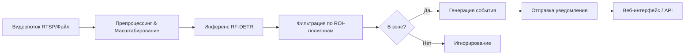

# О проекте
Система анализирует видеопоток в реальном времени, обнаруживает людей с помощью модели RF-DETR, фильтрует детекции по пользовательским зонам интереса (ROI) и отправляет настраиваемые уведомления в целевые системы. Разработана для безопасности, ритейла, логистики и промышленных объектов.
## Ключевые особенности:
* Высокоточная детекция на базе RF-DETR (Real-Time Detection Transformer)
* Гибкие полигональные зоны с визуальным редактированием
* Модуль маршрутизации событий (Webhook, MQTT, Telegram, REST)
* Оптимизированный инференс
## Как это работает (Pipeline)


1. Захват кадра → чтение из RTSP, файла или камеры, масштабирование для ускорения инференса.
2. Детекция → модель RF-DETR предсказывает bounding boxes людей с confidence threshold.
3. Фильтрация ROI → проверка пересечения бокса с полигонами зоны (cv.pointPolygonTest + геометрическая проверка рёбер).
4. Событие → при обнаружении в зоне генерируется payload с координатами, timestamp, snapshot.
5. Маршрутизация → событие отправляется в настроенные каналы (вебхук, MQTT, мессенджер).
6. Визуализация → аннотации накладываются через supervision, вывод в UI и сохранение лога.
## Быстрый старт
1. Клонирование и окружение
```
git clone https://github.com/Pozdnyakov-Artem/proj
python -m venv venv
source venv/bin/activate  # Windows: venv\Scripts\activate
pip install -r requirements.txt
```
2. Запуск CLI-режима (текущая реализация)
```
python main.py
```
3. Запуск веб-сервера (будущий модуль)
`uvicorn app.server:app --host 0.0.0.0 --port 8000 --reload`
Откройте http://localhost:8000 для доступа к дашборду.
